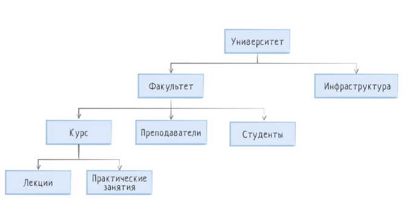
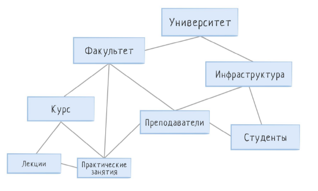
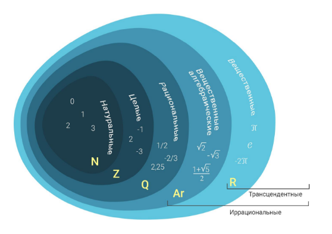
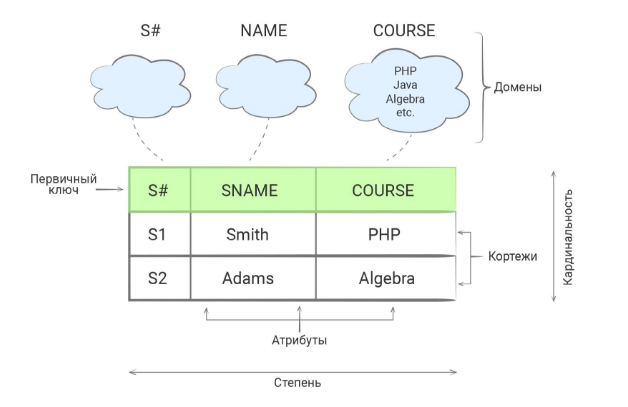

[Содержание](README.md)

# [Структуры данных](https://ru.hexlet.io/courses/rdb-basics/lessons/relations/theory_unit)

### Иерархическая модель

В такой модели данные представлены в виде дерева, где дочерние элементы находятся в зависимости от родительских.

Проблемы начинаются, когда у одного ребёнка может быть несколько родителей.

### Сетевая модель

Эта проблема решается в сетевой модели данных, которая расширяет иерархическую и даёт возможность иметь множество предков. 
В сетевой структуре каждый элемент может быть связан с любым другим элементом.

Эта модель не является полностью независимой от приложения.
Другими словами, если необходимо изменить структуру данных, то нужно изменить и приложение.

### Реляционная модель

В реляционной модели данные представляют собой набор отношений.  
Реляционная база данных это лишь попытка отразить реляционную модель, а не её точная копия.  
Реляционная модель очень сильно опирается на теорию множеств.  

Множество, совокупность произвольных элементов, объединённых по какому-либо признаку,
например, множество натуральных чисел (бесконечное множество) или множество учеников
одного класса (конечное множество).

*Кортеж* — это упорядоченный набор данных фиксированной длины. Элементами кортежа может быть всё что угодно.
*Отношение* — это множество кортежей, называемых телом отношения, в котором каждый кортеж соответствует схеме.  
*Схема* — это заголовок отношения, она описывает общую структуру кортежей, количество элементов внутри
них и их типы. Каждый такой элемент называется атрибутом.  

Данные, представленные в реляционной модели, должны быть нормализованы, то есть приведены к нормальной форме.

Cм. раздел [Нормализация данных](data-normalize.md)

---
[Содержание](README.md)
